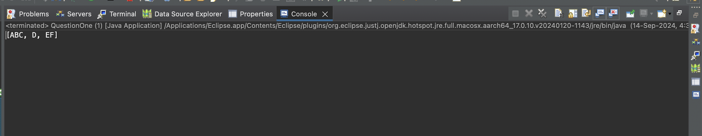
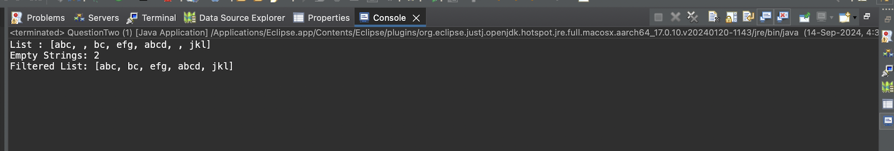
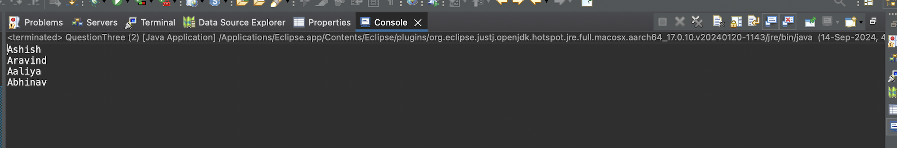
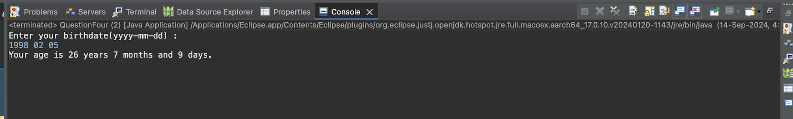

# 🚀 Java Advanced: Stream API, Lambda & Date Handling 


---

## 📌 Overview

This repository contains **advanced Java programs** demonstrating:

- ✔ Stream API  
- ✔ Lambda Expressions  
- ✔ `java.time` Date and Time Handling  
- ✔ Functional Processing  
- ✔ Real-world transformations & filtering  

The project includes **four tasks (Q1.1 – Q1.4)** focusing on stream operations, filtering collections, and age calculation using `LocalDate`.

---

## 📁 Project Structure

| File | Description | Category |
|------|-------------|----------|
| `src/QuestionOne.java` | Converts a list of strings to uppercase using Streams | Q1.1 |
| `src/QuestionTwo.java` | Filters non‑empty strings from a list | Q1.2 |
| `src/QuestionThree.java` | Filters names starting with 'A' using Stream + Lambda | Q1.3 |
| `src/QuestionFour.java` | Calculates a user's age using `LocalDate` | Q1.4 |
| `screenshots/1.png` | Screenshot for Q1.1 | Screenshot |
| `screenshots/2.png` | Screenshot for Q1.2 | Screenshot |
| `screenshots/3.png` | Screenshot for Q1.3 | Screenshot |
| `screenshots/4.png` | Screenshot for Q1.4 | Screenshot |

---

## 🧠 Task Breakdown (Grid)

### 🔹 Q1.1 — Convert Strings to Uppercase
Transforms a list of strings using the Stream API.

### 🔹 Q1.2 — Filter Non‑Empty Strings  
Removes empty strings from a list using stream filtering.

### 🔹 Q1.3 — Filter Students Starting with “A”  
Uses a lambda expression and stream filter operation.

### 🔹 Q1.4 — Age Calculator Using LocalDate  
Parses a birthdate (YYYY‑MM‑DD) and computes age in **years, months, days**.

---

## 🖼 Screenshots (Grid Layout)

| Q1.1 | Q1.2 |
|------|------|
|  |  |

| Q1.3 | Q1.4 |
|------|------|
|  |  |

---

## ▶️ How to Run

1. **Clone the Repository**:
   ```bash
   git clone https://github.com/TheComputationalCore/java-advanced-streams-lambda-date.git
   ```
2. **Navigate to the Project Directory**:
   ```bash
   cd java-advanced-streams-lambda-date
   ```
 3. **Compile the Java Files**:
   ```bash  
      javac src/*.java
   ```
4. **Run the Desired Program**:
   ```bash
   java src/QuestionOne     # Q1.1
   java src/QuestionTwo     # Q1.2
   java src/QuestionThree   # Q1.3
   java src/QuestionFour    # Q1.4
   ```

---

## 🛠 Tech Stack

- **Java 17**
- **Stream API**
- **Lambda Expressions**
- **java.time.LocalDate**
- **Collections & Functional Programming**

---

## 📦 Requirements

- JDK 8 or higher (Java 17 recommended)
- Terminal / IDE (IntelliJ, VS Code, Eclipse, etc.)

---

## 🏷 Topics

`java` • `streams` • `lambda` • `functional-programming` • `localdate` • `date-handling`

---

## 📜 License

Distributed under the **MIT License**.

---


